# PVE Tools Pro -- 项目总览

## 项目愿景

PVE Tools Pro 是一个面向 Proxmox VE 9.x 的交互式 Bash 运维工具集。目标是把高频、易错、需要大量人工检查的 PVE 运维动作收口为一个更清晰的菜单驱动工具，配合更严格的校验和更明确的高风险提示，降低误操作概率。

**官网**: https://pve.u3u.icu | **仓库**: https://github.com/PVE-Tools/PVE-Tools-9

## 架构总览

项目自 v9.0.0 完成模块化重构：单一 14000+ 行脚本拆分为基础设施层（lib/）与功能模块层（src/modules/），通过 build.sh 组装为单文件发布，用户侧零感知。交互层统一收口到 `lib/menu.sh` 菜单框架。

- **入口层**: `PVE-Tools.sh`（约 330 行）-- 本地开发时按固定顺序 source lib/ 与 src/modules/（各模块 init.sh 显式优先）；远程 curl 运行时从 GitHub Releases（`releases/latest/download/PVE-Tools.sh`）下载构建产物执行，带重试/限速/校验/原子落盘守护。
- **基础设施层**: `lib/` -- 全局变量(config.sh)、日志/UI/确认/备份/GRUB(core.sh)、菜单交互框架(menu.sh)、网络检测/镜像选择(network.sh)、运行时守卫与主循环(runtime.sh)。
- **功能模块层**: `src/modules/` -- 10 个子目录对应主菜单 1-10 项，每个子目录内按功能拆分文件（init.sh 为菜单入口）。
- **构建系统**: `build.sh` 按顺序拼接 lib/*.sh + src/modules/**/*.sh 为 `dist/PVE-Tools.sh`（gitignore，CI 构建）；`dev.sh` 直接 source 全部源码供开发调试。
- **辅助工具集**: `Tools/` 集成来自 tteck 社区的 13 个独立维护脚本（不参与构建，供用户手动执行）。
- **插件市场**: `Modules/` 提供第三方脚本与二进制资产；`Modules/VGPU/*.so` 是 vGPU Unlock 功能的下载资产，不可删改。
- **CI/CD**: `.github/workflows/` 提供 release、beta-release、pr-validation 三条流水线（详见 [.github/CLAUDE.md](./.github/CLAUDE.md)）。

## 模块结构图

```mermaid
graph TD
    ROOT["PVE Tools Pro (根)"] --> MAIN["PVE-Tools.sh<br/>入口脚本 ~330行"]
    ROOT --> LIB["lib/<br/>基础设施层"]
    ROOT --> SRC["src/modules/<br/>功能模块层"]
    ROOT --> TOOLS["Tools/"]
    ROOT --> MODS["Modules/"]
    ROOT --> DOCS["Docs/"]
    ROOT --> GHA[".github/"]
    ROOT --> BUILD["build.sh + dev.sh<br/>构建与开发入口"]

    LIB --> LIBC["config.sh<br/>全局变量/镜像/URL"]
    LIB --> LIBCORE["core.sh<br/>颜色/日志/确认/备份/GRUB"]
    LIB --> LIBMENU["menu.sh<br/>统一菜单交互框架"]
    LIB --> LIBNET["network.sh<br/>网络检测/镜像选择"]
    LIB --> LIBRUN["runtime.sh<br/>守卫/主菜单/main()"]

    SRC --> M01["01-optimization<br/>日常优化与通知"]
    SRC --> M02["02-sources<br/>软件源与系统升级"]
    SRC --> M03["03-boot-kernel<br/>启动与内核管理"]
    SRC --> M04["04-gpu-passthrough<br/>硬件直通与显卡"]
    SRC --> M05["05-vm-container<br/>虚拟机运维与导入"]
    SRC --> M06["06-networking<br/>宿主机网络与防火墙"]
    SRC --> M07["07-storage-disk<br/>存储与磁盘维护"]
    SRC --> M08["08-tools-about<br/>诊断工具与项目信息"]
    SRC --> M09["09-security<br/>安全中心"]
    SRC --> M10["10-third-party<br/>第三方工具"]

    GHA --> W1["workflows/<br/>release/beta/PR"]

    click ROOT "./CLAUDE.md" "返回根文档"
    click LIB "./lib/CLAUDE.md" "查看 lib 模块文档"
    click SRC "./src/CLAUDE.md" "查看 src 模块文档"
    click TOOLS "./Tools/CLAUDE.md" "查看 Tools 模块文档"
    click MODS "./Modules/CLAUDE.md" "查看 Modules 模块文档"
    click GHA "./.github/CLAUDE.md" "查看 CI/CD 模块文档"
```



## 模块索引

| 模块路径 | 语言 | 职责 | 入口文件 | 文档 |
|---|---|---|---|---|
| `/` (根) | Bash | 入口脚本：本地 source / 远程下载 Releases 单文件 | `PVE-Tools.sh` (~330行) | `README.md` |
| `lib/` | Bash | 基础设施层：全局变量、日志、UI、菜单框架、网络、运行时 | `config.sh`, `core.sh`, `menu.sh`, `network.sh`, `runtime.sh` | [lib/CLAUDE.md](./lib/CLAUDE.md) |
| `src/modules/` | Bash | 功能模块层：10 个子模块，对应主菜单 1-10 | 各 `*/init.sh` | [src/CLAUDE.md](./src/CLAUDE.md) |
| `Tools/` | Bash | 第三方系统维护脚本集（13个，不参与构建） | 各 `.sh` 文件 | [Tools/CLAUDE.md](./Tools/CLAUDE.md) |
| `Modules/` | Bash/二进制 | 插件市场与分发资产（VGPU .so 为下载资产） | `install-zsh.sh`, `VGPU/*.so` | [Modules/CLAUDE.md](./Modules/CLAUDE.md) |
| `Docs/` | Markdown | 补充文档与《重构计划》设计稿 | `future-guide.md`, `重构计划-PVE-Tools模块化拆分.md` | -- |
| `.github/` | YAML | CI/CD 工作流与 Issue 模板 | `workflows/*.yml` | [.github/CLAUDE.md](./.github/CLAUDE.md) |

## 技术栈

| 层面 | 技术 | 版本/说明 |
|---|---|---|
| 运行环境 | Proxmox VE 9.x (Debian 13 Trixie) | 要求 root 权限 |
| 主脚本语言 | GNU Bash | 模块化源码；通过 build.sh 组装为单文件分发 |
| 构建系统 | bash + find + sort | `build.sh` 顺序拼接 lib/ -> src/modules/ -> dist/PVE-Tools.sh |
| 开发模式 | bash dev.sh | 直接 source 全部源文件，无需构建 |
| CI/CD | GitHub Actions | release / beta-release / PR validation；发布物为 dist 单文件 + SHA256SUMS |
| 许可证 | GPL-3.0 | 详见 `LICENSE` |

## 运行与开发

### 用户使用

```bash
# Cloudflare 短域名（推荐）
bash <(curl -sSL https://pve.u3u.icu/PVE-Tools.sh)

# 中国大陆网络
bash <(curl -sSL https://ghfast.top/raw.githubusercontent.com/PVE-Tools/PVE-Tools-9/main/PVE-Tools.sh)

# 本地开发
bash dev.sh
```

### 开发工作流

```bash
# 改代码 -> 直接运行验证
bash dev.sh

# 确认改好了 -> 构建单文件
bash build.sh

# 验证构建产物
bash -n dist/PVE-Tools.sh

# 静态检查
shellcheck -f gcc PVE-Tools.sh
shellcheck -f gcc dist/PVE-Tools.sh
find lib src/modules -name '*.sh' -print0 | xargs -0 shellcheck --severity=error -f gcc
```

### 构建与加载顺序（事实描述）

`build.sh` 按以下固定顺序拼接：
1. `lib/config.sh` -> `lib/core.sh` -> `lib/menu.sh` -> `lib/network.sh` -> `lib/runtime.sh`（硬编码列表）
2. `src/modules/**/*.sh` 按路径名排序（`find | sort -z`），**不对 init.sh 做特殊处理**

三个入口的模块加载策略并不相同：`build.sh` 与 `dev.sh` 为纯字典序；`PVE-Tools.sh` 本地模式显式先 source 各目录的 init.sh 再加载其余文件。这一差异不影响运行——**bash 中函数定义顺序与调用无关**，所有模块文件只定义函数，真正的执行入口是文件末尾追加的 `main "$@"`。因此不要写"顶层立即执行且依赖其他模块函数"的代码。

## 交互层规范（lib/menu.sh 框架）

所有菜单必须使用统一框架，禁止手写 `while true` 菜单循环：

```bash
foo_menu() {
    run_menu "标题" foo_menu_render foo_menu_dispatch "0-N"
}
foo_menu_render() {        # 只打印功能选项与说明行，不打印返回项/页脚/读取提示
    show_menu_option "1" "..."
}
foo_menu_dispatch() {      # case 处理选项；未识别 return 1；末尾必须 return 0
    case "$1" in
        1) do_thing ;;
        *) return 1 ;;
    esac
    return 0
}
```

框架职责：清屏、标题、统一"0 返回"项（文案按嵌套深度自动生成：一级"返回主菜单"/更深"返回上级菜单"）、带色读取提示、EOF 与 Ctrl+C 守卫（视为返回上级，杜绝死循环）、无效输入报错、pause 节奏（动作后暂停一次；进出子菜单与返回不暂停，由 `MENU_SKIP_PAUSE` 传递）。

输入原语：`prompt_value <变量名> <提示语> [默认值] [校验函数]`（默认值统一 `[默认值]` 尾括号标注；无默认时空回车=取消 return 2）、`prompt_yes_no <提示语> [默认]`、`prompt_pick_from_list <变量名> <提示> <数组名>`（0=返回，return 2，与 `vm_select_*` 选择器约定一致）、`show_report`（长输出接分页器）。

### 确认体系（两档）

- **轻档 `confirm_action "<动作描述>"`**（输入 yes）：可逆的配置写入，如写 cron、apt 源重写、hdparm 参数、一般服务操作。
- **重档 `confirm_high_risk_action <动作> <风险> <影响> <建议> <确认词>`**（输入指定确认词）：以下操作**必须**使用重档 --
  写 GRUB/VFIO 配置、驱动黑名单+initramfs、安装第三方 deb/内核、apt-mark hold、LVM 删除/缩容、qm 磁盘槽位删除、Ceph 卸载、防火墙规则清空、SSH 加固、批量删除类操作。
- 确认词风格：大写短语，如 `IOMMU-ON` / `IOMMU-OFF` / `NVIDIA-HOST` / `AMD-HOST` / `QEMU-MOD` / `DETACH` / `DESTROY-CEPH` / `APPLY-NET` / `CONFIRM`。
- 风险横幅（`vm_show_data_risk_banner` / `host_network_show_risk_banner`）每会话仅完整展示一次。

### 系统配置写入规范

- 修改系统文件前 `backup_file`（备份至 `/var/backups/pve-tools/`）。
- 成块写入一律走 `apply_block <file> <MARKER> <content>` / `remove_block`（`# PVE-TOOLS BEGIN/END <MARKER>` 围栏，自动备份、幂等、可清理）。GPU 直通各方案的 marker 登记与互斥检测见 `gpu_detect_active_stacks`（`src/modules/04-gpu-passthrough/iommu.sh`）。
- GRUB 内核参数只通过 `grub_add_param` / `grub_remove_param` / `grub_has_param`（数组化按 key 精确增删查）。
- 默认内核切换优先 `proxmox-boot-tool kernel pin`（GRUB 与 systemd-boot 均适用）。

## 术语表（文案统一约定）

| 类别 | 统一用法 | 避免 |
|---|---|---|
| 虚拟机 | 首次出现"虚拟机 (VM)"，后文可用 VM | 混用"虚机/客户机" |
| 动词 | 创建 / 删除 / 修改 / 查看 | 新增/添加/移除/展示 混用 |
| 子菜单命名 | "XX 管理"（常驻功能）、"XX 向导"（一次性流程）、"XX 工具箱"（杂项集合） | 面板/助手/中心 随意混用 |
| 颜色语义 | RED=危险/不可逆、YELLOW=警告/提示、GREEN=成功、CYAN(PRIMARY)=交互提示与补充说明、MAGENTA=强调 | 用颜色做纯装饰 |
| 菜单提示 | `请选择操作 [0-N]: `（由框架统一输出） | 手写各种变体 |
| 默认值标注 | `提示语 [默认值]: `（由 prompt_value 统一输出） | `(默认: x)` 等变体 |

## 测试策略

| 类型 | 方式 | 说明 |
|---|---|---|
| 语法检查 | `bash -n`（入口/dev/dist 及全部源文件） | CI 强制 |
| 静态分析 | shellcheck：入口与 dist 为 error+warning 档；lib/ 与 src/ 全量 error 档 | CI 强制 |
| 构建一致性 | 源码与 dist 的函数集合双向 diff | CI 强制（PR 与发布前均执行） |
| 版本一致性 | `CURRENT_VERSION` == `VERSION` == 发布 tag；UPDATE 首行含当前版本 | CI 强制 |
| 安全扫描 | dist 中禁 `eval`、未引号变量 `rm -rf`、`source` 语句 | CI 强制 |
| 功能测试 | 手动在 PVE 9.x 环境验证 | 无自动化 E2E 测试 |

**注意**: 本项目没有自动化单元测试。功能验证依赖人工在真实或模拟的 PVE 9.x 环境中测试。建议每次 PR 同时验证 `bash dev.sh` 与 `bash build.sh && bash -n dist/PVE-Tools.sh`。

## 编码规范

### Bash 脚本规范

- Shebang: `#!/bin/bash`
- 版权声明: 每个文件头部包含 `# SPDX-License-Identifier: GPL-3.0-only` 和 `# Copyright (C) 2026 Ciriu Networks`
- 缩进: 4 空格
- 函数命名: `snake_case`（如 `vm_validate_new_vmid`、`host_network_get_bridges`）；菜单配套函数 `<菜单名>_render` / `<菜单名>_dispatch`
- 变量命名: `UPPER_SNAKE`（全局配置常量）、`lower_case`（局部变量）
- 颜色: 通过 `setup_colors()` 统一管理，遵循 no-color.org 规范（设置 `NO_COLOR` 即禁色）
- 日志: `log_info`、`log_warn`、`log_error`、`log_step`、`log_success`、`log_tips`；所有操作记录到 `/var/log/pve-tools.log`
- UI: `UI_BORDER`、`UI_DIVIDER`、`UI_HEADER`、`UI_FOOTER` 统一边框；菜单一律走 `run_menu` 框架
- 风险控制: 按上文"确认体系（两档）"执行
- 禁止: `eval`、未审 `source`、手写菜单循环、绕过 `qm set` 直接追加写 VM conf、无 marker 的系统配置成块写入

## AI 使用指引

- **模块理解**: 优先阅读各模块的 `CLAUDE.md` 而非直接扫描源代码。
- **入口分析**: `PVE-Tools.sh` 约 330 行。核心为下载器函数族 `pve_tools_entry_download_file()` / `_download_with_curl()` / `_download_with_wget()` / `_validate_script()` 与末段的本地/远程分流 if 块。
- **基础设施分析**: `lib/core.sh`（~505 行）日志/确认/备份/块写入/GRUB；`lib/menu.sh`（~186 行）菜单框架；`lib/runtime.sh`（~232 行）守卫与 `main()`。
- **功能模块分析**: 各子目录 `init.sh` 为菜单入口（run_menu + render + dispatch），其他文件为具体功能实现。
- **忽略的构建产物**: `dist/`、`node_modules/` 被 `.gitignore` 忽略且不参与分析。
- **二进制文件**: `Modules/VGPU/*.so` 只记录路径，不读取内容；它是 vGPU Unlock 的下载资产，勿删。
- **已移除**: `Web/` VitePress 文档站已移除；发布流程不使用 shc 编译二进制。

## 变更记录 (Changelog)

| 日期 | 变更 | 来源 |
|---|---|---|
| 2026-07-26 | 交互层框架化：新增 lib/menu.sh，全部菜单迁移 run_menu；确认体系两档成文；GPU 直通 marker 统一与互斥检测；GRUB 参数函数数组化；文档按现实重写（修正入口行数/远程模式/shc 等失真）；仓库卫生清理；CI 护栏补全 | 交互层收口整理 |
| 2026-07-08 | 项目模块化重构完成：单文件拆分为 lib/ + src/modules/（10 子模块）。新增 build.sh/dev.sh。Web/ 目录移除。 | claude-init 架构师 |
| 2026-04-28 | 初始化 CLAUDE.md 体系 | claude-init 架构师 |
